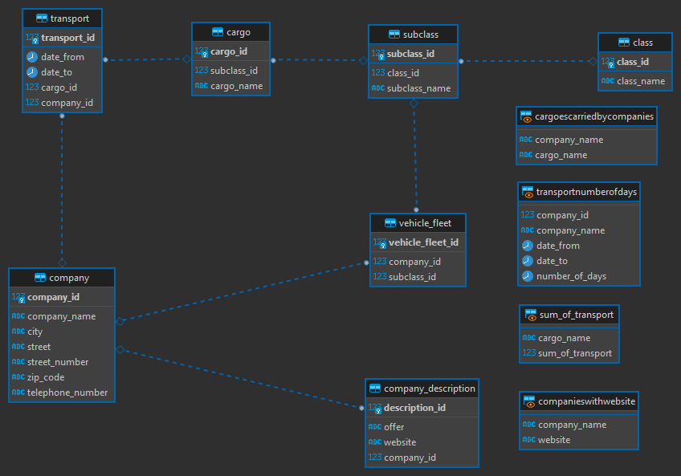

# Database of transportation companies specializing in the transportation of foodstuffs

The database contains information about food articles and the transportation companies involved in their transport. 
This enables the verification of criteria that must be met for a given load to be transported under specific conditions. 
The database also allows for recording past and planned shipments, monitoring inventory status, and facilitating transportation of loads by a transportation company.

Below you can find the ER diagram of my database.

